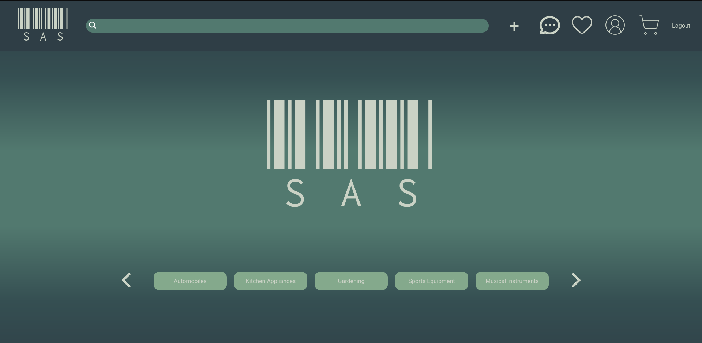
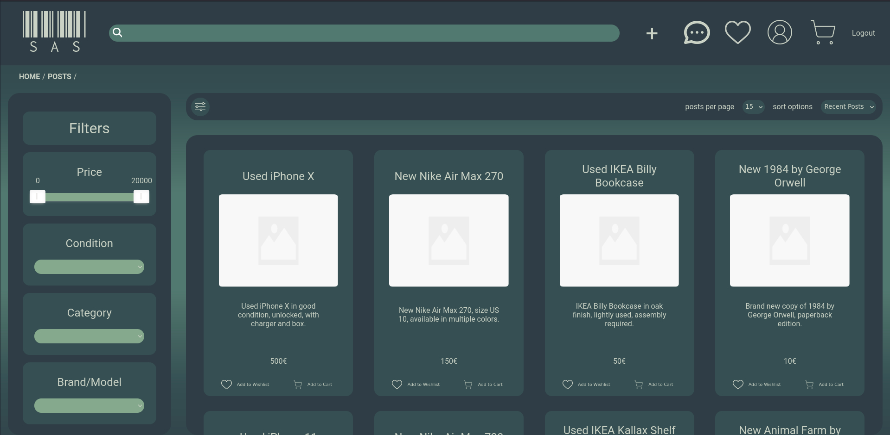
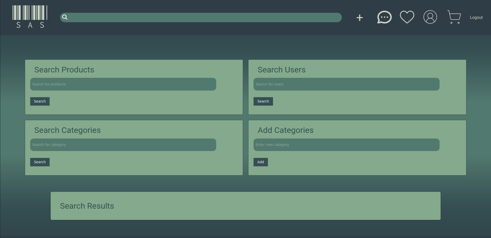

# Smooth As Silk

## Group ltw06g03

- Alexandre Silva (up202206633) 33%
- Eduardo Cunha (up202207126) 33%
- Filipe Esteves (up202206515) 33%

## Install Instructions

(adapt this)

    #!/bin/bash

    find ./user_images ! -name '.gitignore' -type f -exec rm -f {} +

    # Start PHP server on port 9000
    php -S localhost:9000 &

    # Wait for the server to start (adjust the sleep time if needed)
    sleep 2

    # Create the database using sqlite3
    sqlite3 database/database.db < database/ProjectDataBase.sql
    sqlite3 database/database.db < database/ProjectDataBase_Pop.sql

    # Print a message indicating that the initialization is complete
    echo "Initialization complete."

## Screenshots

## Implemented Features

**General**:

- [x] Register a new account.
- [x] Log in and out.
- [x] Edit their profile, including their name, username, password, and email.

**Sellers**  should be able to:

- [x] List new items, providing details such as category, brand, model, size, and condition, along with images.
- [x] Track and manage their listed items.
- [x] Respond to inquiries from buyers regarding their items and add further information if needed.
- [x] Print shipping forms for items that have been sold.

**Buyers**  should be able to:

- [x] Browse items using filters like category, price, and condition.
- [ ] Engage with sellers to ask questions or negotiate prices.
- [x] Add items to a wishlist or shopping cart.
- [x] Proceed to checkout with their shopping cart (simulate payment process).

**Admins**  should be able to:

- [x] Elevate a user to admin status.
- [x] Introduce new item categories, sizes, conditions, and other pertinent entities.
- [x] Oversee and ensure the smooth operation of the entire system.

**Security**:
We have been careful with the following security aspects:

- [x] **SQL injection**
- [ ] **Cross-Site Scripting (XSS)**
- [ ] **Cross-Site Request Forgery (CSRF)**

**Password Storage Mechanism**: hash_password&verify_password

**Aditional Requirements**:

We also implemented the following additional requirements (you can add more):

- [ ] **Rating and Review System**
- [ ] **Promotional Features**
- [ ] **Analytics Dashboard**
- [ ] **Multi-Currency Support**
- [ ] **Item Swapping**
- [ ] **API Integration**
- [ ] **Dynamic Promotions**
- [ ] **User Preferences**
- [ ] **Shipping Costs**
- [x] **Real-Time Messaging System**
